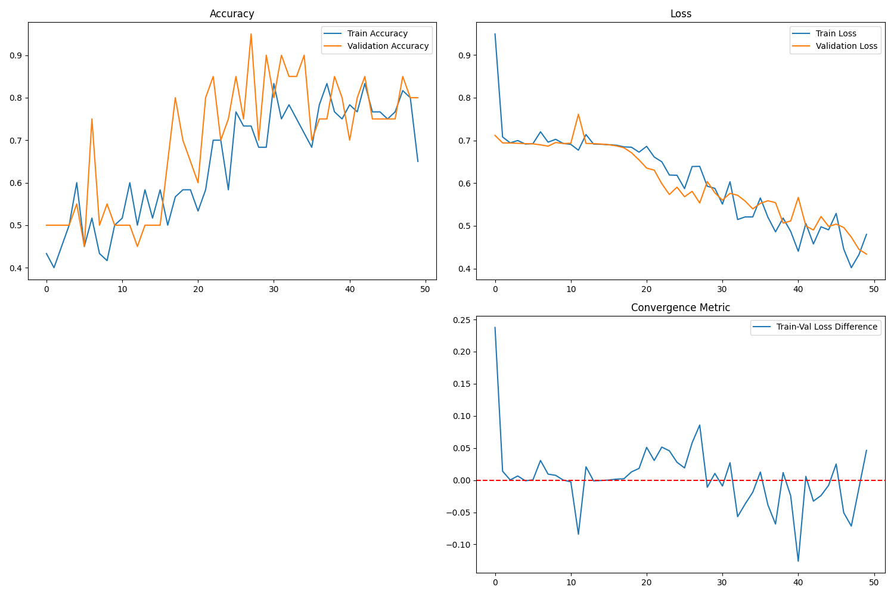

# Pen vs Pencil Image Recognition
 An Image Recognition Program that identifies whether an image contains a pencil or a pen.

# Description:
    This is a Python Program which identifies whether an image contains a pencil or a pen which runs on :
    
    -> Python 3.12
    -> TensorFlow 2.19.0
    -> Nvidia's CUDA - 12.8

    And Here are the Result of Training:
    

    
# Note: 
    This code was created using CUDA installed in WSL (Windows Subsystem for Linux). However, you can run it on Windows without CUDA by modifying the file paths in the source file. And The Trained Model was Removed from the repository Because of Filesize limit in GitHub.

📽️ [Watch the demo video](Video.mp4)
